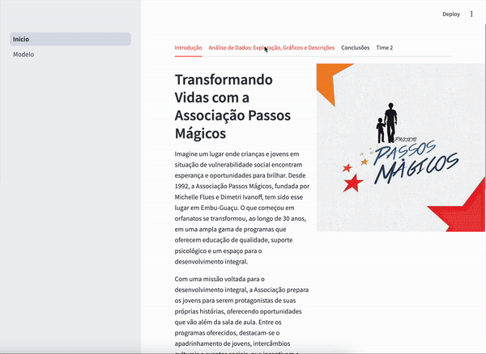

# Projeto de Deep Learning - Previsão do Ponto de Virada Educacional

Este projeto utiliza análise exploratória de dados e um modelo de Deep Learning para prever se um aluno atingiu o "Ponto de Virada" em seu desenvolvimento educacional. O projeto foi desenvolvido utilizando Python e Streamlit para visualização interativa.

[Clique aqui para acessar o projeto](https://datathon-fiap-nv7enwub9tw364zkkvqy8a.streamlit.app/)



## Estrutura do Projeto

- **`Inicio.py`**: O arquivo principal da aplicação Streamlit.
- **`requirements.txt`**: Contém todas as dependências necessárias para o projeto.
- **`data/`**: Contém os datasets utilizados para análise e modelagem (adicione o caminho correto, se aplicável).
- **`models/`**: Diretório para salvar ou carregar modelos treinados (se aplicável).

## Pré-requisitos

Certifique-se de ter o **Python 3.7** ou superior instalado em sua máquina.

## Instalação

Siga os passos abaixo para configurar o ambiente e rodar o projeto:

### 1. Clone este repositório

```bash
git clone https://github.com/seu-usuario/seu-projeto.git
cd seu-projeto
```

### 2. Crie um ambiente virtual (opcional, mas recomendado)

```bash
python -m venv venv
source venv/bin/activate  # Para Linux/macOS
# No Windows:
# venv\Scripts\activate
```

### 3. Instale as dependências

As dependências do projeto estão listadas no arquivo `requirements.txt`. Para instalar, execute:

```bash
pip install -r requirements.txt
```

### 4. Execute o projeto

Após instalar as dependências, você pode iniciar a aplicação Streamlit com o seguinte comando:

```bash
streamlit run Inicio.py
```

Isso abrirá o aplicativo em seu navegador padrão. Caso a página não abra automaticamente, você pode acessar manualmente em `http://localhost:8501`.

## Observações

- Certifique-se de que todos os arquivos necessários, como os datasets, estejam na pasta correta.
- Se você encontrar algum problema, verifique se todas as dependências estão instaladas corretamente e que você está utilizando a versão correta do Python.
